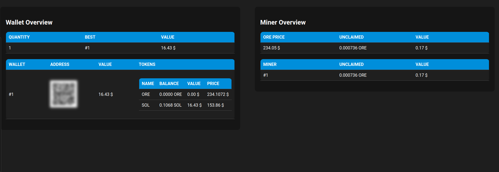

# Ore Dashboard


## Introduction

A tiny dashboard for visualizing ORE mining data. It utilizes Golang for backend logic and HTML/CSS/JavaScript for the user interface.
Currently, the update frequency has been set statically, every 60 seconds.

## Prerequisites

- Golang 1.21
- [Ore CLI](https://ore.supply/download)
- Solana Keypair Folder: each file must have sintax like "**id_x.json**" where "**x**" is an integer

## Build:

Clone the repository into a local directory:

```bash
$ git clone https://github.com/palmatovic/ore_dashboard.git
```


Navigate to the project directory:

```bash
$ cd ore_dashboard.git
```

Build the project by running the following command:

```bash
$ go build ./...
```

## Environment:

**Solana CLI**
```bash
$ export SOLANA_CLI=<SOLANA_CLI_FOLDER_PATH>
```

**RPC Url**
```bash
$ export RPC_URL=<RPC_URL>
```
**ORE CLI**
```bash
$ export ORE_CLI=<YOUR_ORE_BIN_FILEPATH>
```

**Keypairs folder path**
```bash
$ export KEY_PAIR_FOLDER_PATH=<KEY_PAIR_FOLDER_PATH>
```
**Jupiter Api Url**
```bash
$ export JUP_API_URL=https://price.jup.ag/v4/price?ids=
```

**Servert Port**
```bash
$ export SERVER_PORT=<PORT_NUMBER>
```

## Run:

```bash
$ go run main.go
```

## Server:
Enjoy Ore Dashboard
``` html
http://localhost:<YOUR_PORT>
```


### Using systemd for Executable Deployment (Linux only)

To ensure your server is always running and starts automatically upon system boot, consider using systemd to manage your executable process.

 * **Create a systemd service file**:
   Create a new systemd service file in the `/etc/systemd/system/` directory. For example, name it `your_service_name.service`.

```bash
[Service]
Type=simple
WorkingDirectory=<PROJECT_PATH>
ExecStart=<YOUR EXECUTABLE PATH>
Restart=always
RestartSec=3
User=<YOUR_USER>
Environment="ORE_CLI=<YOUR_ORE_BIN_FILEPATH>"
Environment="SOLANA_CLI=<YOUR_SOLANA_CLI_FOLDERPATH>"
Environment="RPC_URL=<YOUR_RPC_URL>"
Environment="KEY_PAIR_FOLDER_PATH=<YOUR_KEY_PAIR_FORLDER_PATH>"
Environment="JUP_API_URL=https://price.jup.ag/v4/price?ids="
Environment="SERVER_PORT=<YOUR_PORT>"
```

 * **Configure the service file**:
   Within the service file, specify the full path to your executable as well as any necessary environment variables. Ensure to configure dependencies and other parameters required for your service.

 * **Enable and start the service**:
   After configuring the service file, enable it for automatic startup at system boot and immediately start the service using the following commands:
```bash
$ sudo systemctl enable your_service_name
```
```bash
$ sudo systemctl init your_service_name
```

## Screenshots




## Tips & Feedback

If you find this project helpful and wish to further support the developer, consider leaving a tip! Tips are a way to show appreciation for the work done and can help motivate the developer to continue improving and updating the project.

- **Virtual Coffee**: A small gesture to keep the developer awake and focused during long coding sessions.
- **Project Contribution**: Contribute code, report bugs, or suggest new features.
- **Feedback and Support**: Provide positive feedback and support to the developers in community discussions or via email.
- **Solana Wallet**: You can also leave a tip via Solana. Here's the wallet address: 6WdbjXJuQ25cLWnh1D8m8gBeHD1W9dAJByVqKifTSNh

Thank you for your support and for helping make this project even better!

## Authors

- [@palmatovic](https://www.github.com/palmatovic)
